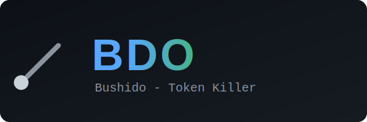

<p align="center">
  
</p>

<p align="center">
  <strong>High-performance CLI proxy that reduces LLM token consumption by 60-90%</strong>
</p>

<p align="center">
  <a href="https://github.com/tedorigawa001/TokenReductionTool/actions"></a>
  <a href="https://github.com/tedorigawa001/TokenReductionTool/releases"></a>
  <a href="https://opensource.org/licenses/Apache-2.0"></a>
</p>

<p align="center">
  <a href="https://github.com/tedorigawa001/TokenReductionTool">Website</a> &bull;
  <a href="#installation">Install</a> &bull;
  <a href="docs/guide/resources/troubleshooting.md">Troubleshooting</a> &bull;
  <a href="docs/contributing/ARCHITECTURE.md">Architecture</a>
</p>

<p align="center">
  <a href="README.md">English</a> &bull;
  <a href="README_ja.md">日本語</a>
</p>

---

bdo filters and compresses command outputs before they reach your LLM context. Single Rust binary, 100+ supported commands, <10ms overhead.

## Token Savings (30-min Claude Code Session)

| Operation | Frequency | Standard | bdo | Savings |
|-----------|-----------|----------|-----|---------|
| `ls` / `tree` | 10x | 2,000 | 400 | -80% |
| `cat` / `read` | 20x | 40,000 | 12,000 | -70% |
| `grep` / `rg` | 8x | 16,000 | 3,200 | -80% |
| `git status` | 10x | 3,000 | 600 | -80% |
| `git diff` | 5x | 10,000 | 2,500 | -75% |
| `git log` | 5x | 2,500 | 500 | -80% |
| `git add/commit/push` | 8x | 1,600 | 120 | -92% |
| `cargo test` / `npm test` | 5x | 25,000 | 2,500 | -90% |
| `ruff check` | 3x | 3,000 | 600 | -80% |
| `pytest` | 4x | 8,000 | 800 | -90% |
| `go test` | 3x | 6,000 | 600 | -90% |
| `docker ps` | 3x | 900 | 180 | -80% |
| **Total** | | **~118,000** | **~23,900** | **-80%** |

> Estimates based on medium-sized TypeScript/Rust projects. Actual savings vary by project size.

## Installation

### Homebrew

```bash
brew tap tedorigawa001/tap && brew install bdo
```

### Quick Install (Linux/macOS)

```bash
curl -fsSL https://raw.githubusercontent.com/tedorigawa001/TokenReductionTool/refs/heads/master/install.sh | sh
```

> Installs to `~/.local/bin`. Add to PATH if needed:
> ```bash
> echo 'export PATH="$HOME/.local/bin:$PATH"' >> ~/.bashrc  # or ~/.zshrc
> ```

### Cargo

```bash
cargo install --git https://github.com/tedorigawa001/TokenReductionTool
```

### Pre-built Binaries

Download from [releases](https://github.com/tedorigawa001/TokenReductionTool/releases):
- macOS: `bdo-x86_64-apple-darwin.tar.gz` / `bdo-aarch64-apple-darwin.tar.gz`
- Linux: `bdo-x86_64-unknown-linux-musl.tar.gz` / `bdo-aarch64-unknown-linux-gnu.tar.gz`
- Windows: `bdo-x86_64-pc-windows-msvc.zip`

> **Windows users**: Extract the zip and place `bdo.exe` somewhere in your PATH (e.g. `C:\Users\<you>\.local\bin`). Run Bushido from **Command Prompt**, **PowerShell**, or **Windows Terminal** — do not double-click the `.exe` (it will flash and close). For the best experience, use [WSL](https://learn.microsoft.com/en-us/windows/wsl/install) where the full hook system works natively. See [Windows setup](#windows) below for details.

### Verify Installation

```bash
bdo --version   # Should show "bdo 0.42.2"
bdo gain        # Should show token savings stats
```

## Quick Start

```bash
# 1. Install for your AI tool
bdo init -g                     # Claude Code / Copilot (default)
bdo init -g --gemini            # Gemini CLI
bdo init -g --codex             # Codex (OpenAI)
bdo init -g --agent cursor      # Cursor
bdo init -g --agent windsurf    # Windsurf
bdo init --agent cline          # Cline / Roo Code
bdo init --agent kilocode       # Kilo Code
bdo init --agent antigravity    # Google Antigravity
bdo init -g --agent pi          # Pi
bdo init --agent hermes         # Hermes

# 2. Restart your AI tool, then test
git status  # Automatically rewritten to bdo git status
```

Hook-based agents rewrite Bash commands (e.g., `git status` -> `bdo git status`) before execution. Plugin-based agents, including Hermes, use their plugin API to rewrite commands before execution. The agent receives compact output without needing to call `bdo` explicitly.

**Important:** the hook only runs on Bash tool calls. Claude Code built-in tools like `Read`, `Grep`, and `Glob` do not pass through the Bash hook, so they are not auto-rewritten. To get Bushido's compact output for those workflows, use shell commands (`cat`/`head`/`tail`, `rg`/`grep`, `find`) or call `bdo read`, `bdo grep`, or `bdo find` directly.

## How It Works

```
  Without bdo:                                    With bdo:

  Claude  --git status-->  shell  -->  git         Claude  --git status-->  Bushido  -->  git
    ^                                   |            ^                      |          |
    |        ~2,000 tokens (raw)        |            |   ~200 tokens        | filter   |
    +-----------------------------------+            +------- (filtered) ---+----------+
```

Four strategies applied per command type:

1. **Smart Filtering** - Removes noise (comments, whitespace, boilerplate)
2. **Grouping** - Aggregates similar items (files by directory, errors by type)
3. **Truncation** - Keeps relevant context, cuts redundancy
4. **Deduplication** - Collapses repeated log lines with counts

## Commands

### Files
```bash
bdo ls .                        # Token-optimized directory tree
bdo read file.rs                # Auto: light cleanup, smart truncation for large source files
bdo read file.rs -l none        # Full content when exact text matters
bdo read file.rs -l aggressive  # Heavier cleanup (drops more boilerplate)
bdo read file.rs -l outline     # Signatures only — every fn/struct/trait, bodies elided
bdo map src/                    # Repo map: top-level signatures of every file under a dir
bdo smart file.rs               # 2-line heuristic code summary
bdo find "*.rs" .               # Compact find results
bdo grep "pattern" .            # Grouped search results
bdo diff file1 file2            # Condensed diff
```

#### Code map (`bdo map`)

Get the API surface of an entire directory in one shot — every file's top-level
declarations, function bodies elided. Ideal for onboarding an agent to a new
codebase without reading (and paying for) every file.

```console
$ bdo map src/core
runner.rs
  pub fn run(cmd: Command, tool_name: &str, args_display: &str, mode: RunMode<'_>, opts: RunOptions<'_>) -> Result<i32> { … }
  pub struct RunOptions<'a> { … }
  pub enum RunMode<'a> { … }
stream.rs
  pub trait StreamFilter { … }
  pub fn run_streaming(cmd: &mut Command, stdin_mode: StdinMode, stdout_mode: FilterMode<'_>) -> Result<StreamResult> { … }
…
— 16 files, 245 signatures (full source: 9,188 lines)
```

On this repo that's **~74,000 tokens of source rendered in ~3,500** (≈95%
reduction) with the complete top-level API intact. Supports Rust, Go, JS/TS, C,
C++, Java, and Python; respects `.gitignore`.

For Python, function bodies are elided with a `…` marker (the analogue of
`{ … }`), `async def` is handled like `def`, and multi-line signatures are
folded onto one line:

```python
async def run(task: Task, retries: int = 3) -> Result: …
class Config: …
```

#### Change review (`bdo review`)

A one-shot summary of a change set for human + agent review — what you'd
otherwise assemble by hand from `git status`, `rg`, and `cargo test`:

```console
$ bdo review                 # working-tree changes (default)
$ bdo review --against origin/main   # whole-branch diff vs a ref

bdo review — 3 changed file(s) (uncommitted)

CHANGED
  M  src/core/filter.rs
  ?? src/cmds/system/review.rs

⚠ ARTIFACTS (0)
  ✓ none
⚠ STALE MARKERS (1) — verify before commit
  scripts/x.sh:27  broken install URL (blob serves HTML)

🧪 SUGGESTED TESTS
  cargo test -- filter review
```

It flags stray build artifacts (`__pycache__`, `target/`, `.bak` …), high-signal
stale markers (legacy names, broken install URLs), and the inline test modules
worth running for the changed Rust files.

### Git
```bash
bdo git status                  # Compact status
bdo git log -n 10               # One-line commits
bdo git diff                    # Condensed diff
bdo git add                     # -> "ok"
bdo git commit -m "msg"         # -> "ok abc1234"
bdo git push                    # -> "ok main"
bdo git pull                    # -> "ok 3 files +10 -2"
```

### GitHub CLI
```bash
bdo gh pr list                  # Compact PR listing
bdo gh pr view 42               # PR details + checks
bdo gh issue list               # Compact issue listing
bdo gh run list                 # Workflow run status
```

### Test Runners
```bash
bdo jest                        # Jest compact (failures only)
bdo vitest                      # Vitest compact (failures only)
bdo playwright test             # E2E results (failures only)
bdo pytest                      # Python tests (-90%)
bdo go test                     # Go tests (NDJSON, -90%)
bdo cargo test                  # Cargo tests (-90%)
bdo rake test                   # Ruby minitest (-90%)
bdo rspec                       # RSpec tests (JSON, -60%+)
bdo err <cmd>                   # Filter errors only from any command
bdo test <cmd>                  # Generic test wrapper - failures only (-90%)
```

### Build & Lint
```bash
bdo lint                        # ESLint grouped by rule/file
bdo lint biome                  # Supports other linters
bdo tsc                         # TypeScript errors grouped by file
bdo next build                  # Next.js build compact
bdo prettier --check .          # Files needing formatting
bdo cargo build                 # Cargo build (-80%)
bdo cargo clippy                # Cargo clippy (-80%)
bdo ruff check                  # Python linting (JSON, -80%)
bdo golangci-lint run           # Go linting (JSON, -85%)
bdo rubocop                     # Ruby linting (JSON, -60%+)
```

### Package Managers
```bash
bdo pnpm list                   # Compact dependency tree
bdo pip list                    # Python packages (auto-detect uv)
bdo pip outdated                # Outdated packages
bdo bundle install              # Ruby gems (strip Using lines)
bdo prisma generate             # Schema generation (no ASCII art)
```

### AWS
```bash
bdo aws sts get-caller-identity # One-line identity
bdo aws ec2 describe-instances  # Compact instance list
bdo aws lambda list-functions   # Name/runtime/memory (strips secrets)
bdo aws logs get-log-events     # Timestamped messages only
bdo aws cloudformation describe-stack-events  # Failures first
bdo aws dynamodb scan           # Unwraps type annotations
bdo aws iam list-roles          # Strips policy documents
bdo aws s3 ls                   # Truncated with tee recovery
```

### Containers
```bash
bdo docker ps                   # Compact container list
bdo docker images               # Compact image list
bdo docker logs <container>     # Deduplicated logs
bdo docker compose ps           # Compose services
bdo kubectl pods                # Compact pod list
bdo kubectl logs <pod>          # Deduplicated logs
bdo kubectl services            # Compact service list
```

### Data & Analytics
```bash
bdo json config.json            # Structure without values
bdo deps                        # Dependencies summary
bdo env -f AWS                  # Filtered env vars
bdo log app.log                 # Deduplicated logs
bdo curl <url>                  # Truncate + save full output
bdo wget <url>                  # Download, strip progress bars
bdo summary <long command>      # Heuristic summary
bdo proxy <command>             # Raw passthrough + tracking
```

### Token Savings Analytics
```bash
bdo gain                        # Summary stats
bdo gain --graph                # ASCII graph (last 30 days)
bdo gain --history              # Recent command history
bdo gain --daily                # Day-by-day breakdown
bdo gain --all --format json    # JSON export for dashboards

bdo discover                    # Find missed savings opportunities
bdo discover --all --since 7    # All projects, last 7 days

bdo session                     # Show Bushido adoption across recent sessions
```

## Global Flags

```bash
-u, --ultra-compact    # ASCII icons, inline format (extra token savings)
-v, --verbose          # Increase verbosity (-v, -vv, -vvv)
```

## Examples

**Directory listing:**
```
# ls -la (45 lines, ~800 tokens)        # bdo ls (12 lines, ~150 tokens)
drwxr-xr-x  15 user staff 480 ...       my-project/
-rw-r--r--   1 user staff 1234 ...       +-- src/ (8 files)
...                                      |   +-- main.rs
                                         +-- Cargo.toml
```

**Git operations:**
```
# git push (15 lines, ~200 tokens)       # bdo git push (1 line, ~10 tokens)
Enumerating objects: 5, done.             ok main
Counting objects: 100% (5/5), done.
Delta compression using up to 8 threads
...
```

**Test output:**
```
# cargo test (200+ lines on failure)     # bdo test cargo test (~20 lines)
running 15 tests                          FAILED: 2/15 tests
test utils::test_parse ... ok               test_edge_case: assertion failed
test utils::test_format ... ok              test_overflow: panic at utils.rs:18
...
```

## Auto-Rewrite Hook

The most effective way to use Bushido. The hook transparently intercepts Bash commands and rewrites them to bdo equivalents before execution.

**Result**: 100% bdo adoption across all conversations and subagents, zero token overhead.

**Scope note:** this only applies to Bash tool calls. Claude Code built-in tools such as `Read`, `Grep`, and `Glob` bypass the hook, so use shell commands or explicit `bdo` commands when you want Bushido filtering there.

### Setup

```bash
bdo init -g                 # Install hook + Bushido.md (recommended)
bdo init -g --opencode      # OpenCode plugin (instead of Claude Code)
bdo init -g --auto-patch    # Non-interactive (CI/CD)
bdo init -g --hook-only     # Hook only, no Bushido.md
bdo init --show             # Verify installation
```

After install, **restart Claude Code**.

## Windows

Bushido works on Windows with some limitations. The auto-rewrite hook (`bdo hook`) requires a Unix shell, so on native Windows Bushido falls back to **CLAUDE.md injection mode** — your AI assistant receives Bushido instructions but commands are not rewritten automatically.

### Recommended: WSL (full support)

For the best experience, use [WSL](https://learn.microsoft.com/en-us/windows/wsl/install) (Windows Subsystem for Linux). Inside WSL, Bushido works exactly like Linux — full hook support, auto-rewrite, everything:

```bash
# Inside WSL
curl -fsSL https://raw.githubusercontent.com/tedorigawa001/TokenReductionTool/refs/heads/master/install.sh | sh
bdo init -g
```

### Native Windows (limited support)

On native Windows (cmd.exe / PowerShell), Bushido filters work but the hook does not auto-rewrite commands:

```powershell
# 1. Download and extract bdo-x86_64-pc-windows-msvc.zip from releases
# 2. Add bdo.exe to your PATH
# 3. Initialize (falls back to CLAUDE.md injection)
bdo init -g
# 4. Use bdo explicitly
bdo cargo test
bdo git status
```

**Important**: Do not double-click `bdo.exe` — it is a CLI tool that prints usage and exits immediately. Always run it from a terminal (Command Prompt, PowerShell, or Windows Terminal).

| Feature | WSL | Native Windows |
|---------|-----|----------------|
| Filters (cargo, git, etc.) | Full | Full |
| Auto-rewrite hook | Yes | No (CLAUDE.md fallback) |
| `bdo init -g` | Hook mode | CLAUDE.md mode |
| `bdo gain` / analytics | Full | Full |

## Supported AI Tools

Bushido supports 14 AI coding tools. Each integration rewrites shell commands to `bdo` equivalents for 60-90% token savings where the agent supports command interception.

| Tool | Install | Method |
|------|---------|--------|
| **Claude Code** | `bdo init -g` | PreToolUse hook (bash) |
| **GitHub Copilot (VS Code)** | `bdo init -g --copilot` | PreToolUse hook — transparent rewrite |
| **GitHub Copilot CLI** | `bdo init -g --copilot` | PreToolUse deny-with-suggestion (CLI limitation) |
| **Cursor** | `bdo init -g --agent cursor` | preToolUse hook (hooks.json) |
| **Gemini CLI** | `bdo init -g --gemini` | BeforeTool hook |
| **Codex** | `bdo init -g --codex` | AGENTS.md + Bushido.md instructions |
| **Windsurf** | `bdo init -g --agent windsurf` | .windsurfrules (project-scoped) |
| **Cline / Roo Code** | `bdo init --agent cline` | .clinerules (project-scoped) |
| **OpenCode** | `bdo init -g --opencode` | Plugin TS (tool.execute.before) |
| **OpenClaw** | `openclaw plugins install ./openclaw` | Plugin TS (before_tool_call) |
| **Pi** | `bdo init -g --agent pi` (global) | TypeScript extension (tool_call) |
| **Hermes** | `bdo init --agent hermes` | Python plugin adapter (terminal command mutation via `bdo rewrite`) |
| **Mistral Vibe** | Planned ([#800](https://github.com/tedorigawa001/TokenReductionTool/issues/800)) | Blocked on upstream |
| **Kilo Code** | `bdo init --agent kilocode` | .kilocode/rules/bdo-rules.md (project-scoped) |
| **Google Antigravity** | `bdo init --agent antigravity` | .agents/rules/antigravity-bdo-rules.md (project-scoped) |

For per-agent setup details, override controls, and graceful degradation, see the [Supported Agents guide](docs/guide/getting-started/supported-agents.md). The Hermes plugin source and tests live in `hooks/hermes/`; installed Hermes runtime files still live under `~/.hermes/plugins/bdo-rewrite/`.

## Configuration

`~/.config/bdo/config.toml` (macOS: `~/Library/Application Support/bdo/config.toml`):

```toml
[hooks]
exclude_commands = ["curl", "playwright"]  # skip rewrite for these

[tee]
enabled = true          # save raw output on failure (default: true)
mode = "failures"       # "failures", "always", or "never"
```

When a command fails, Bushido saves the full unfiltered output so the LLM can read it without re-executing:

```
FAILED: 2/15 tests
[full output: ~/.local/share/bdo/tee/1707753600_cargo_test.log]
```

For the full config reference (all sections, env vars, per-project filters), see the [Configuration guide](docs/guide/getting-started/configuration.md).

### Uninstall

```bash
bdo init -g --uninstall     # Remove hook, Bushido.md, settings.json entry
cargo uninstall bdo          # Remove binary
brew uninstall bdo           # If installed via Homebrew
```

## Documentation

- **[docs/guide](https://github.com/tedorigawa001/TokenReductionTool/tree/master/docs/guide)** — full user guide (installation, supported agents, what gets optimized, analytics, configuration, troubleshooting)
- **[INSTALL.md](INSTALL.md)** — detailed installation reference
- **[ARCHITECTURE.md](docs/contributing/ARCHITECTURE.md)** — system design and technical decisions
- **[CONTRIBUTING.md](CONTRIBUTING.md)** — contribution guide
- **[SECURITY.md](SECURITY.md)** — security policy

## Privacy & Telemetry

Bushido can collect **anonymous, aggregate usage metrics** once per day. Telemetry is **disabled by default** and requires **explicit opt-in consent** (GDPR Art. 6, 7) during `bdo init` or via `bdo telemetry enable`. This data helps us build a better product: identifying which commands need filters, which filters need improvement, and how much value Bushido delivers. For the full list of fields, data handling, and contributor guidelines, see **[docs/TELEMETRY.md](docs/TELEMETRY.md)**.

**What is collected and why:**

| Category | Data | Why |
|----------|------|-----|
| Identity | Salted device hash (SHA-256, not reversible) | Count unique installations without tracking individuals |
| Environment | Bushido version, OS, architecture, install method | Know which platforms to support and test |
| Usage volume | Command count (24h), total commands, tokens saved (24h/30d/total) | Measure adoption and value delivered |
| Quality | Top 5 passthrough commands (0% savings), parse failure count, commands with <30% savings | Identify missing filters and weak ones to improve |
| Ecosystem | Command category distribution (e.g. git 45%, cargo 20%, js 15%) | Prioritize filter development for popular ecosystems |
| Retention | Days since first use, active days in last 30 | Understand engagement and detect churn |
| Adoption | AI agent hook type (claude/gemini/codex), custom TOML filter count | Track integration coverage and DSL adoption |
| Configuration | Whether config.toml exists, number of excluded commands, project count | Understand user maturity and customization patterns |
| Features | Usage counts for meta-commands (gain, discover, proxy, verify) | Know which Bushido features are valued vs unused |
| Economics | Estimated USD savings (based on API token pricing) | Quantify the value Bushido provides to users |

All data is **aggregate counts or anonymized command names** (first 3 words, no arguments). Top commands report only tool names (e.g. "git", "cargo"), never full command lines.

**What is NOT collected:** source code, file paths, command arguments, secrets, environment variables, personal data, or repository contents.

**Manage telemetry:**
```bash
bdo telemetry status     # Check current consent state
bdo telemetry enable     # Give consent (interactive prompt)
bdo telemetry disable    # Withdraw consent — stops all collection immediately
bdo telemetry forget     # Withdraw consent + delete all local data + request server-side erasure
```

**Override via environment:**
```bash
export BDO_TELEMETRY_DISABLED=1   # Blocks telemetry regardless of consent
```

## Star History

<a href="https://www.star-history.com/?repos=tedorigawa001%2FTokenReductionTool&type=date&legend=top-left">
 <picture>
   <source media="(prefers-color-scheme: dark)" srcset="https://api.star-history.com/chart?repos=tedorigawa001/TokenReductionTool&type=date&theme=dark&legend=top-left" />
   <source media="(prefers-color-scheme: light)" srcset="https://api.star-history.com/chart?repos=tedorigawa001/TokenReductionTool&type=date&legend=top-left" />
   
 </picture>
</a>

## StarMapper

<a href="https://starmapper.bruniaux.com/tedorigawa001/TokenReductionTool">
  <picture>
    <source media="(prefers-color-scheme: dark)" srcset="https://starmapper.bruniaux.com/api/map-image/tedorigawa001/TokenReductionTool?theme=dark" />
    <source media="(prefers-color-scheme: light)" srcset="https://starmapper.bruniaux.com/api/map-image/tedorigawa001/TokenReductionTool?theme=light" />
    
  </picture>
</a>

## Core team

- **Patrick Szymkowiak** — Founder
  [GitHub](https://github.com/pszymkowiak) · [LinkedIn](https://www.linkedin.com/in/patrick-szymkowiak/)
- **Florian Bruniaux** — Core contributor
  [GitHub](https://github.com/FlorianBruniaux) · [LinkedIn](https://www.linkedin.com/in/florian-bruniaux-43408b83/)
- **Adrien Eppling** — Core contributor
  [GitHub](https://github.com/aeppling) · [LinkedIn](https://www.linkedin.com/in/adrien-eppling/)

## Contributing

Contributions welcome! Please open an issue or PR on [GitHub](https://github.com/tedorigawa001/TokenReductionTool).

## License

Apache License 2.0 - see [LICENSE](LICENSE) for details.

## Disclaimer

See [DISCLAIMER.md](DISCLAIMER.md).
